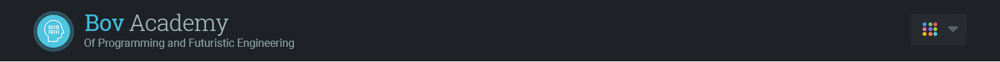
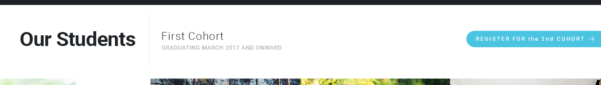
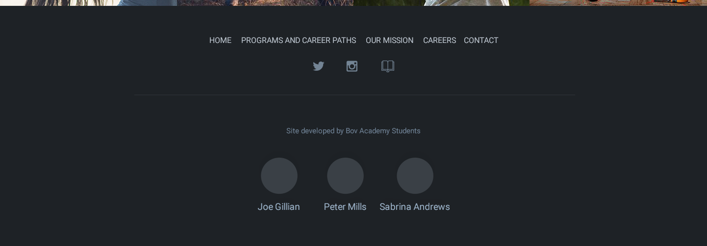
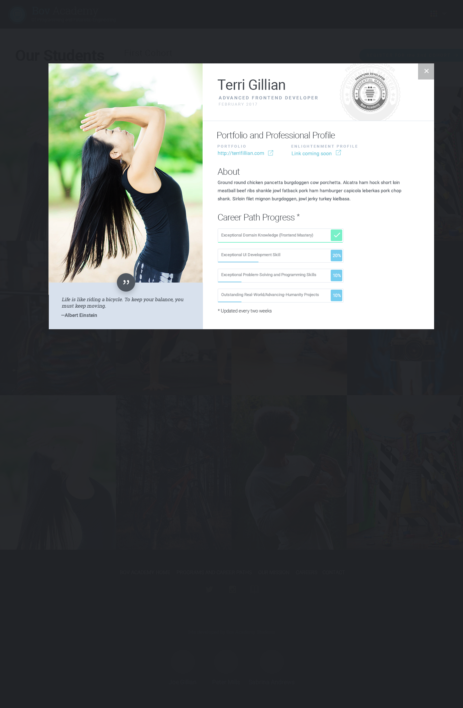

#Project Checklist

##Base Site
The base site includes the heading, white heading area below the heading, the photo grid, and the footer.

* **Build header**

    * Include Bov Academy logo on the left [incomplete]

    * Include dropdown element on the right (with down arrow icon) [incomplete]

*What the header should look like*
 

* **Build the white sub-header area**

    * Include "Our Students" header on left [incomplete]

    * Include smaller "FIRST COHORT - GRADUATING MATCH 2017 AND ONWARD" text next to header [incomplete]

    * Include "REGISTER FOR THE 2ND COHORT" button on right (with arrow icon) [incomplete]

*What the sub-header area should look like*
 

* **Build the image grid**

    * Build the 12 images into a grid system [incomplete]

    * The grid should comprise four columns at larger screen widths and then dynamically change to two columns at smaller viewport sizes [incomplete]

    * Use flexbox for the grid [incomplete]

    * From Richard: "The UI design shows four columns for the photos. On desktops, when the window is wide enough to accommodate four columns, we will show the four columns. But when the browser window is too narrow to show four columns, we will show two columns. Note that we will not show three columns. A couple of days after the hackathon, you will learn why we will show either two columns or four columns and never three columns."

*What the image grid should look like (with four columns); we don't have an image of the two-column layout*
 

* **Build the footer**

    * Include nav list items at top [incomplete]

    * Include social media icons [incomplete]

    * Include horizontal rule (line) [incomplete]

    * Include "SITE DEVELOPED BY ACADEMY STUDENTS" text below line [incomplete]

    * Include images of the three of us at the bottom of the footer with our names below each one [incomplete]

*What the footer should look like*
 

##Modal
This is the checklist for the image modal. it will pop up when the user clisks on any one of the twelve images; the modal includes the enlarged image, and text below the image:

*What the modal image should look like; this image does not include the text below the image*
 

* **Animate image**

    * Upon being clicked, the image should become larger (transform: scale?) and move to the top of the screen [incomplete]

    * Leave enough space below the image for the text [incomplete]

* **Animate text**

    * When the image is clicked, pieces of text need to fade in below the image; we need ot achieve a cascading effect, with the larger text fading up first and the smaller parts fading up slightly later (see [here](http://tympanus.net/Development/ImageGridEffects/index2.html) for example) [incomplete]

* **Darken background**

    * This is similar to the modal some of us have built into our portfolios. The screen behind the image and text should darken, so you only see the animated features (the image and text). This will be reversed when the user closes the modal [incomplete]

* **Add X (cancel) image to top righthand corner**

    * The X button is what will close the modal. It needs to reverse all of the animations done previously (see [here](http://tympanus.net/Development/ImageGridEffects/index2.html) for example)  [incomplete]

* **Write JavaScript to handle click events**

    * Here's my (Sebastian's) idea: add JavaScript event handlers to the images and the X cancel button. These event handlers will add classes to the animated  items (the image and the text below) causing them to animate when the modal is opened and fade away when the modal is closed. Shouldn't be too tricky. See the JS file in the "animation-testing" folder in the "Team Resources" folder for my first stab at this. Kinda works.  [incomplete]

